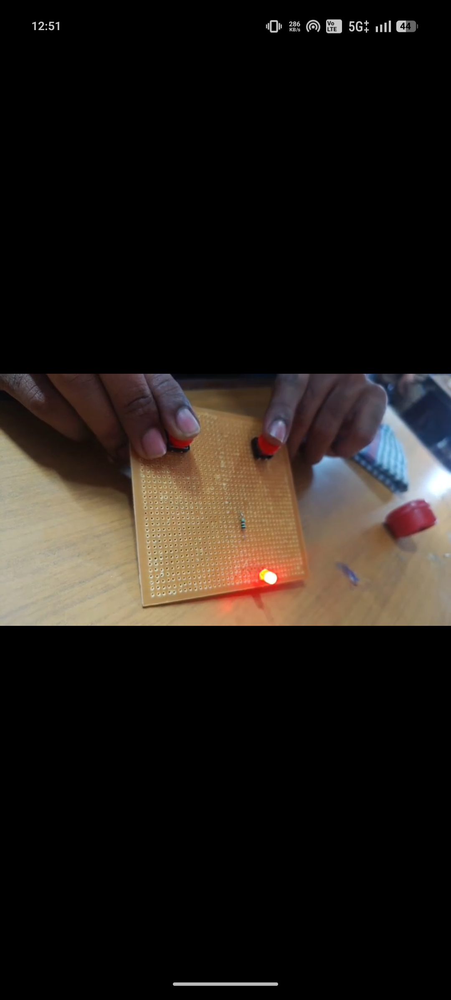
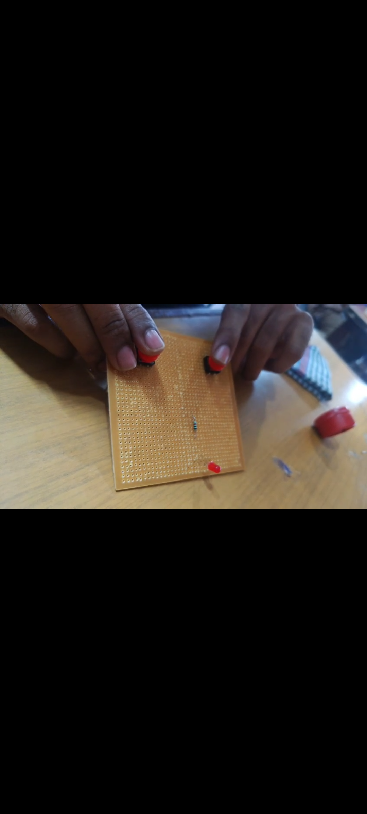

# AND Gate using LED, Switches, and Resistor

A simple hardware implementation of a **2-input AND gate** built on a perfboard using two push-button switches, a resistor, and an LED. The circuit demonstrates basic digital logic using discrete electronic components instead of an IC.

## Overview

In a 2-input AND gate, the output is HIGH (`1`) only when **both** inputs are HIGH (`1`). This project mimics that behavior physically:

- Two push-button switches act as **Input A** and **Input B**.
- The LED acts as the **Output**.
- The LED lights up **only when both switches are pressed simultaneously**, replicating AND gate logic.

## Components Used

| Component        | Quantity | Purpose                          |
|-------------------|----------|-----------------------------------|
| Push-button switch | 2        | Represent logic inputs A and B    |
| LED                | 1        | Represents the logic output       |
| Resistor           | 1        | Current-limiting resistor for LED |
| Perfboard          | 1        | Base for building the circuit     |
| Jumper wires        | As needed | Connections between components   |
| Power source (battery/supply) | 1 | Powers the circuit |

## Circuit Logic

The two push-button switches are connected **in series** between the power supply and the LED (with the current-limiting resistor in line). This series arrangement is what produces AND gate behavior:

- If **either switch is open (not pressed)**, the circuit path is broken and the LED stays **OFF**.
- Only when **both switches are closed (pressed)** does current flow through the resistor and LED, turning it **ON**.

### Truth Table

| Switch A | Switch B | LED (Output) |
|----------|----------|---------------|
| 0 (Open) | 0 (Open) | 0 (OFF)       |
| 0 (Open) | 1 (Pressed) | 0 (OFF)    |
| 1 (Pressed) | 0 (Open) | 0 (OFF)    |
| 1 (Pressed) | 1 (Pressed) | 1 (ON)  |

## Circuit Images

**Both switches pressed — LED ON (Output = 1):**

## on 

**One or both switches released — LED OFF (Output = 0):**

## off 

## How It Works

1. Power flows from the source through **Switch A**.
2. From Switch A, it continues through **Switch B** (series connection).
3. If both switches are closed, current reaches the **resistor**, which limits current to a safe level for the LED.
4. Current then flows through the **LED**, lighting it up.
5. Breaking the connection at either switch stops current flow, turning the LED off — exactly matching AND gate logic.

## Applications

This basic circuit is a foundational example used to:
- Understand digital logic gates using physical/analog components.
- Learn series circuit behavior.
- Build intuition before working with logic gate ICs (like the 7408 AND gate IC) or programmable logic.
## Problem Statement

Digital logic gates are fundamental building blocks of all electronic and computing systems, yet learners are often introduced to them only through simulations or ready-made ICs, with little hands-on understanding of how the underlying logic is physically realized through circuit behavior.
There is a need for a simple, low-cost, hardware-based demonstration that helps students visually and physically understand how logic gates work at the circuit level — using basic components rather than abstract truth tables or pre-packaged IC chips.
This prototype addresses that gap by implementing a 2-input AND gate using discrete components (push-button switches, a resistor, and an LED) on a perfboard. By manually operating the switches and observing the LED's response, users can directly experience how a series circuit connection produces AND gate behavior — where the output is active only when all inputs are simultaneously active — reinforcing core digital logic concepts through a tangible, hands-on approach.
